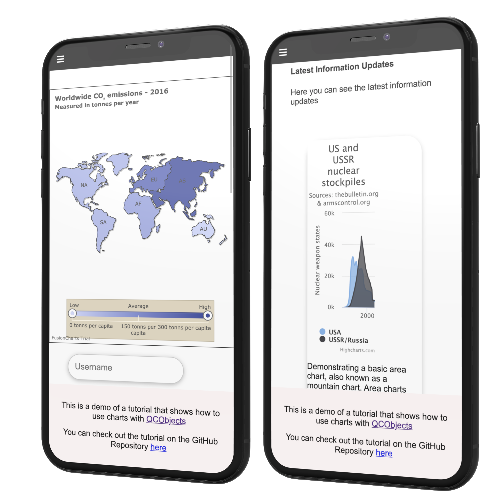
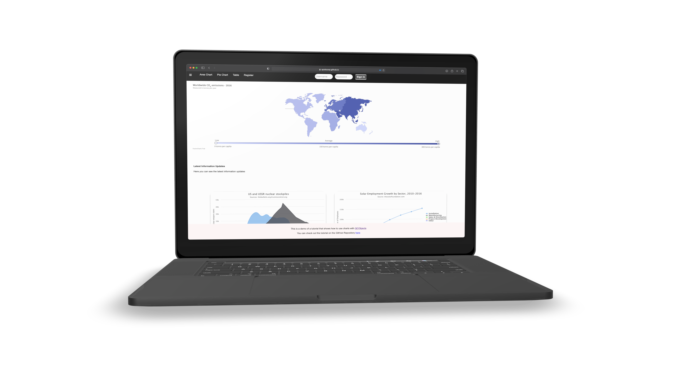

# QCObjects Charts Template App

Learn more about QCObjects framework in [https://qcobjects.com](https://qcobjects.com)

This is a custom template to create a PWA with examples using chart components. This templates uses [Highcharts](https://www.highcharts.com) and [Fusioncharts](fusioncharts.com) to render the charts.

## License

Please read the [QCObjects License](https://github.com/QuickCorp/QCObjects/blob/master/LICENSE.txt) before you proceed.

## Third Party License

You are responsible to buy or be granted of any third party used in this template and tutorial.

Please read and buy the [license of Highcharts](https://shop.highsoft.com/highcharts) and the [license of FusionCharts](https://www.fusioncharts.com/buy) before to start.

## Live Demo

To check out the [live demo](https://quickcorp.github.io/qcobjects-charts/) of this template, please click [here](https://quickcorp.github.io/qcobjects-charts/)




## Quick Start

1.- First, create a new progressive web app usign this template. Inside a project folder, Type:

```shell
> qcobjects create mynewapp --custom=qcobjects-charts
```

2.- Now, you can test your new app usign npm test:

> npm i --save-dev jasmine && npm test

3.- If everything is ok, you can view your app in a browser by launching with the QCObjects Built-In Server:

> qcobjects launch mynewapp

4.- Go to your browser and navigate to https://localhost

# Dashboard Tutorial

## Placing chart components

Go to templates/components/charts folder and place a new chart template, for css normalising purposes, it is recomended to enclose your template in a **<article></article>** tag:

Here is an example:

```html
<article>
<!-- Your template goes here -->
<style>
        @import url("./css/components/card.css");
        @import url("./css/components/highcharts.css");
</style>

<div class="card">
    <figure class="highcharts-figure">
      <div class="container" id="areachart">
        Loading chart...
      </div>
      <p class="highcharts-description">
          Demonstrating a basic area chart, also known as a mountain chart.
          Area charts are similar to line charts, but commonly used to visualize
          volumes.
      </p>
    </figure>
</div>
<!-- this is the end of your template -->
</article>
```

Now that you have created the chart template, you can use it on any component you want, just name it as the template. Example: if the name of your template is: **basicareachart.tpl.html** then the name you have to use it in the component is **basicareachart**. Name attributes of the components in QCObjects are not unique, so you can use the same name for many components without having issues.

```html
<!--
  As the component template is placed inside a charts subfolder (templates/components/charts)
  Then the name needs to start with "charts/" prefix as a direct reference to the subfolder path
-->
<component name="charts/fc-barcodechart"></component>
```

The result of this is just inserting the html code of the template **templates/components/charts/basicareachart.tpl.html** into the component that you have placed in your main html page

NOTE: check out the prebuilt example in **templates/components/pages/page1.tpl.html**

## Adding behaviour using Controllers

Now you have to add some behaviour to have the new chart loaded into the component and not just dead html tag elements:

First, create a new **QCObjects Controller**, to do so, go to **js/packages/** folder and open
the file **org.example.mycharts.js** to create your custom controllers package:

Here is an example of a Bar Chart by using FusionCharts:

```javascript
'use strict';
// js/packages/org.example.mycharts.js

'use strict';
Package('org.example.mycharts', [
  Class('BarChartFCController', FCController, {
    done: function() {
      // this is an example to build a bar chart using FusionCharts
      var controller = this;
      this.loadFusionCharts().then(
        function() {
          // Your custom datasource for your chart goes here
          // to get more examples and license using FusionCharts, go to fusioncharts.com

          const dataSource = {
            "chart": {
              "caption": "Countries With Most Oil Reserves [2017-18]",
              "subcaption": "In MMbbl = One Million barrels",
              "yaxisname": "Reserves (MMbbl)",
              "captionalignment": "left",
              "numbersuffix": "K",
              "labeldisplay": "AUTO",
              "theme": "fusion"
            },
            "data": [{
                "label": "Venezuela",
                "value": "290"
              },
              {
                "label": "Saudi",
                "value": "260"
              },
              {
                "label": "Canada",
                "value": "180"
              },
              {
                "label": "Iran",
                "value": "140"
              },
              {
                "label": "Russia",
                "value": "115"
              },
              {
                "label": "UAE",
                "value": "100"
              },
              {
                "label": "US",
                "value": "30"
              },
              {
                "label": "China",
                "value": "30"
              }
            ]
          };

          FusionCharts.ready(function() {
            const myChart = new FusionCharts({
              type: "column2d",
              renderAt: "chart-container",
              width: "100%",
              height: "500",
              dataFormat: "json",
              dataSource
            }).render();
          });

          // this is the end of your code

        });
    }
  })
]);
```

NOTE: If you want to create separate files, for instance: one for every Class definition, you must to add the corresponding Import line in the **org.quickcorp.custom.controllers.js** package before for every new package you want to add. It is recomended to use a hierarchy order in your package imports to have a very progressive and quick load of your dependencies.

To use your new **BarChartFCController** into a component, you only need to set up a value in a **controllerClass** attribute of a component tag

```html
<component name="charts/fc-barcodechart" controllerClass="BarChartFCController"></component>
```
